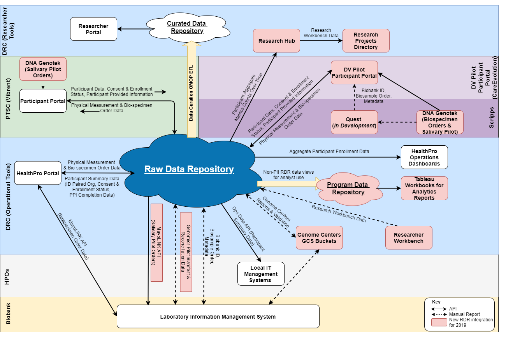

.. RDR Systems Documentation documentation master file, created by
   sphinx-quickstart on Wed Sep 25 08:20:19 2019.
   You can adapt this file completely to your liking, but it should at least
   contain the root `toctree` directive.

+++++++++++++++++++++++++++++++++++++++++
The *All of Us* Raw Data Repository (RDR)
+++++++++++++++++++++++++++++++++++++++++

   Figure 1, the RDR as it fits within the context of the *All of Us* research program.

Purpose
================================================================================
The main purpose of this documentation is to provide a high-level description of the core systems and extended modules of the *All of Us* Raw Data Repository (RDR).  A secondary purpose is to provide some lower-level details of certain fundamental objects that provide the functionality of the RDR core and modular systems.
The target audience of this documentation are non-RDR developers and other All of Us personnel that wish to have a better understanding of the core and extended systems of the RDR.

Table of Contents
================================================================================
.. Table of Contents section

.. toctree::
   :maxdepth: 3

   sys_ref
   api_wf
   issues
   ops-data

General Concepts
================================================================================

Terminology Used
--------------------------------------------------------------------------------

.. glossary::

  Participant
    A participant is a core object in the RDR representing a single person who has initiated the process of joining the *All of Us* research program.  Questionnaires, physical measurements, and biospecimens can be associated to a participant.

  Healthcare Provider Organization (HPO)
    An HPO is an object that represents a health care provider that has partnered with the *All of Us* research program to send data to the RDR, usually through the HealthPro client.
    A participant may have an associated hpoId property. An HPO will have Organizations as children elements.

  Organization
    An organization has an HPO as a parent and sites as children.

  Site
    A site has an organization as a parent and a HPO as a grandparent. A site is associated to a participant and represents the physical location where they entered data or joined.

  Awardee
    Awardee is synonymous with HPO in the context of the RDR.

.. The above concepts are illustrated in Figure 2:

.. TODO:
   figure:: https://ipsumimage.appspot.com/640x360
   :align:  center
   :alt:    General Concepts illustrated.

   Figure 2, General Concepts of the RDR, illustrated.

API Workflows
--------------------------------------------------------------------------------
The following are the API workflows that the RDR supports and are covered in this documentation:

   *  PTC to RDR (Raw Data Repository)
       *  Create and update Participant information
       *  Create and update Questionnaires and Responses ("PPI", Participant-provided information)
       *  Read data about a participant
   *  Health Professional Portal (HPRO) to RDR
       *  Search Participants

          *  At check-in time, look up an individual by name, date of birth, zip code
          *  For a Work Queue, filter participants based on summary information (e.g. age, race)
       *  Get Participant Summary (by ID)
       *  Update a Participant with a new Medical Record Number
       *  Insert results from physical measurements
       *  Insert biospecimen orders
   *  Biobank to RDR
       *  Updates stored Biobank samples via the Biobank reconciliation process
   *  For release management and operational monitoring
       *  Serving version identifier - no auth required

Further Reading
================================================================================
* `Data Dictionary <https://docs.google.com/spreadsheets/d/1Ye-WH5s7OSpPAROpTNUNco5ZsWa4y2OAtf1pvLBdty0/edit#gid=1352645238>`_
* `All of Us <https://www.joinallofus.org/en/about>`_
* `RDR on GitHub <https://github.com/all-of-us/raw-data-repository>`_
