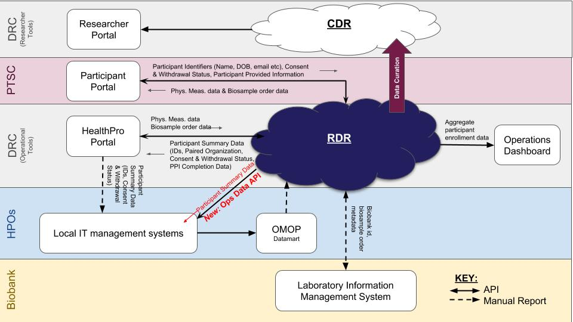

.. RDR Systems Documentation documentation master file, created by
   sphinx-quickstart on Wed Sep 25 08:20:19 2019.
   You can adapt this file completely to your liking, but it should at least
   contain the root `toctree` directive.

+++++++++++++++++++++++++++++++++++++++++
The *All of Us* Raw Data Repository (RDR)
+++++++++++++++++++++++++++++++++++++++++

   Figure 1, the RDR as it fits within the context of the *All of Us* research program.

Purpose
--------------------------------------------------------------------------------
The main purpose of this documentation is to provide a high-level description of the core systems and extended modules of the *All of Us* Raw Data Repository (RDR).  A secondary purpose is to provide some lower-level details of certain fundamental objects that provide the functionality of the RDR core and modular systems.
The target audience of this documentation are non-RDR developers and other All of Us personnel that wish to have a better understanding of the core and extended systems of the RDR.

Table of Contents
--------------------------------------------------------------------------------
.. Table of Contents section

.. toctree::
   :maxdepth: 3

   sys_ref
   api_wf

Further Reading
--------------------------------------------------------------------------------
* `All of Us <https://www.joinallofus.org/en/about>`_
* `RDR on GitHub <https://github.com/all-of-us/raw-data-repository>`_
